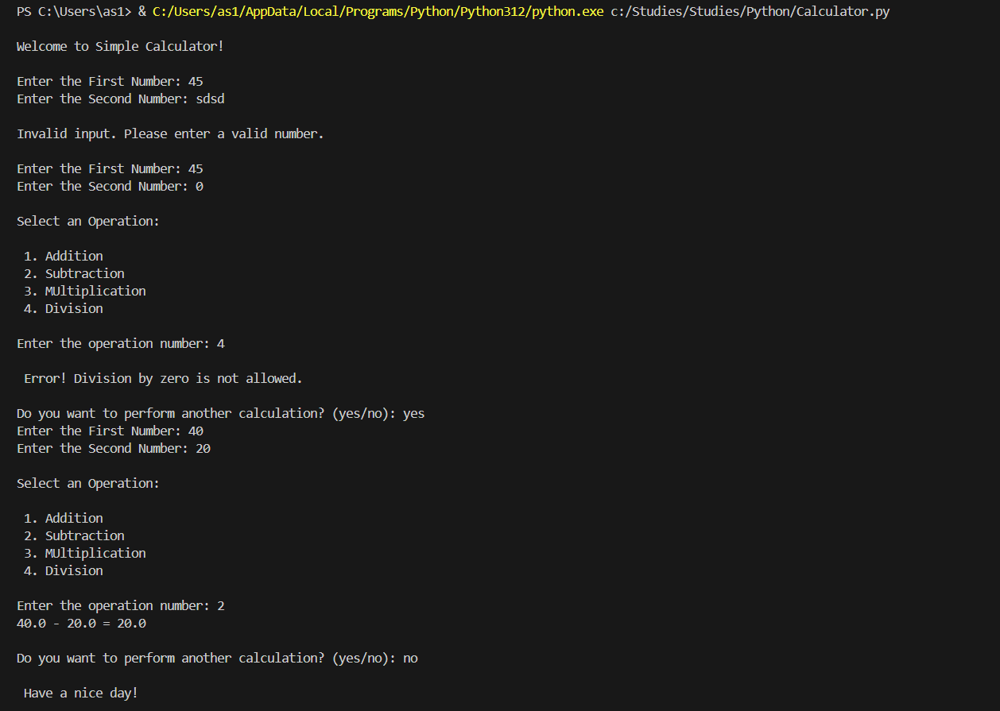

# CS605 Assignment 1 - Simple Calculator

## Description:
 Python-based Calculator Program that allows users to perform basic arithmetic operations, has error handling features including Zero Division and supports continuous calculations.

## User Guide

## Step 1:
	Launch the Calculator by running the program.
## Step 2:
	Enter two Numbers on which you want to perform the operation. The Input should only consist of numerical values.

## Step 3:
	Select the operation by entering the number corresponding to the desired operation.
	Select an operation: 
1. Addition
2. Subtraction
3. Multiplication
4. Division
	You will get the result of the Calculation
## Step 4:
	If you wish to, you can perform another operation by typing “yes” and can exit the program by typing “no”.

## Example:

Welcome to Simple Calculator!

Enter the First Number: 10
Enter the Second Number: 5

Select an Operation: 
 1. Addition 
 2. Subtraction 
 3. Multiplication 
 4. Division

Enter the operation number: 1

10 + 5 = 15

Do you want to perform another calculation? (yes/no): no

Have a nice day!

## OUTPUT 

